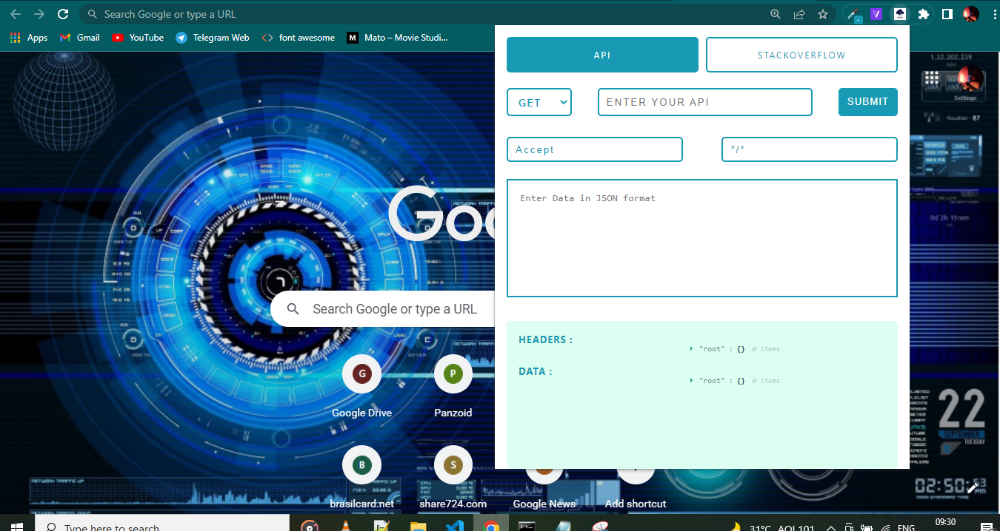
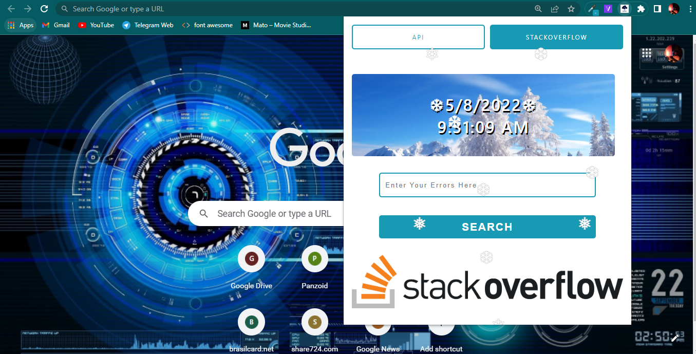

<!--
*** Thanks for checking out my Project. If you have a suggestion
*** that would make this better, please fork the repo and create a pull request
*** or simply open an issue with the tag "enhancement".
*** Don't forget to give the project a star!
*** Thanks again! Now go create something AMAZING! :D
-->

<!-- PROJECT SHIELDS -->

[![LinkedIn][linkedin-shield]](https://www.linkedin.com/in/nishant-kumar-tiwari-253a46196/)
[![LinkedIn][linkedin-shield]](https://www.linkedin.com/in/ayushi20-19/)

<!-- PROJECT LOGO -->
 

  

  <h3 align="center">ApiDesk</h3>

  

    An awesome Google Crome extension for developer.
     
    <a href="https://github.com/Ayushi20-19/apidesk"><strong>Explore App »</strong></a>
     
     
    <a href="https://github.com/Ayushi20-19/apidesk">View Demo</a>
    ·
    <a href="https://github.com/Ayushi20-19/apidesk/issues">Report Bug</a>
    ·
    <a href="https://github.com/Ayushi20-19/apidesk/pulls">Request Feature</a>
  

<!-- TABLE OF CONTENTS -->

  
Table of Contents

  <ol>
    <li>API Testing</li>
    <li>GET request</li>
    <li>POST request</li>
    <li>DELETE request</li>
    <li>StackOverFlow Error Search</li>
    <li>VScode Shortcut Suggestions</li>
    <li>Time</li>
    <li>Simple UI</li>
  </ol>

<!-- ABOUT THE PROJECT -->
## About The Project

https://user-images.githubusercontent.com/47889284/167309290-0622d3fb-3914-4dd1-9e0f-b1e6261aa3c3.mp4

 

There are many great Extensions. however, I didn't find one that really suited a develpoer's needs for API Testing and Error Searching. so I created this enhanced one. I want to create a extension for developers that'll be the last one you ever need -- I think this is it.

Here's why:
* Your time should be focused on only something that deserves. A project that solves a problem and helps others.
* You shouldn't be search again and again for same type of errors by opening new tabs.
* Api Testing without writing any code at one place.

Of course, no extension will serve all demands since your needs may be different. So I'll be adding more features in the near future. You may also suggest changes by forking this repo and creating a pull request or opening an issue. Thanks to all the people have reviewed to expanding this Extension!

### Built With

* [HTML](https://www.w3schools.com/html/)
* [CSS](https://www.w3schools.com/css/)
* [React.js](https://reactjs.org/)

(<a href="#top">back to top</a>)

### Project View

### Prerequisites

1- Working Internet is all you need

<!-- ROADMAP -->

## Contributing

Contributions are what make the open source community such an amazing place to learn, inspire, and create. Any contributions you make are **greatly appreciated**.

If you have a suggestion that would make this better, please fork the repo and create a pull request. You can also simply open an issue with the tag "enhancement".
Don't forget to give the project a star! Thanks again!

1. Fork the Project
2. Create your Feature Branch (`git checkout -b feature/AmazingFeature`)
3. Commit your Changes (`git commit -m 'Add some AmazingFeature'`)
4. Push to the Branch (`git push origin feature/AmazingFeature`)
5. Open a Pull Request

(<a href="#top">back to top</a>)

<!-- HOW TO INSTALL-->

## How to Install ?

--IMPORTANT-- This extension will soon be avilable on crome webstore, It is still under review when the Google Webstore approves it, we will update the link.
for now use below method to test.

1- Download Zip or Clone the project

2- Use <code> npm i</code> or <code> yarn </code> to install all the dependencies.

3- Now use <code> yarn build </code> to create optimised folder.

4- Now you are good to go. just open your crome browser.

5- Open settings > extensions

6- Activate the Developers Mode, on Top right corner.

7- Click on load unpacked button on top left, and upload the build folder.

8- vollaaaa, your extension is installed. feel free to give stars on our project 😂😂😂😂😂

To test use this dummy api below -

https://jsonplaceholder.typicode.com/todos/1

## How to Use ?

Nahhhhhh....Not a rocket Science. just read the artical below.

[ApiDesk Use](https://dev.to/ayushi_verma/apidesk-4gef)

<!-- CONTACT -->
## Contact

Nishant Kumar Tiwari - [@my_Linkedin](https://www.linkedin.com/in/nishant-kumar-tiwari-253a46196/) - nishant88tiwari@gmail.com  
 
Ayushi Verma - [@my_Linkedin](https://www.linkedin.com/in/ayushi20-19/)

Project Link: [ApiDesk](https://github.com/Ayushi20-19/apidesk)

(<a href="#top">back to top</a>)

<!-- MARKDOWN LINKS & IMAGES -->

[linkedin-shield]: https://img.shields.io/badge/-LinkedIn-black.svg?style=for-the-badge&logo=linkedin&colorB=555

